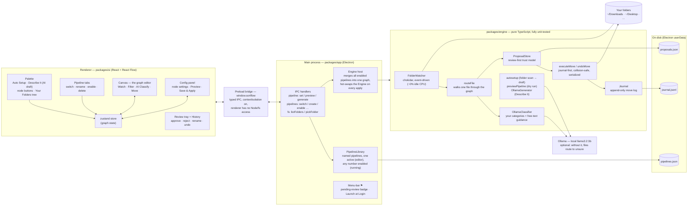
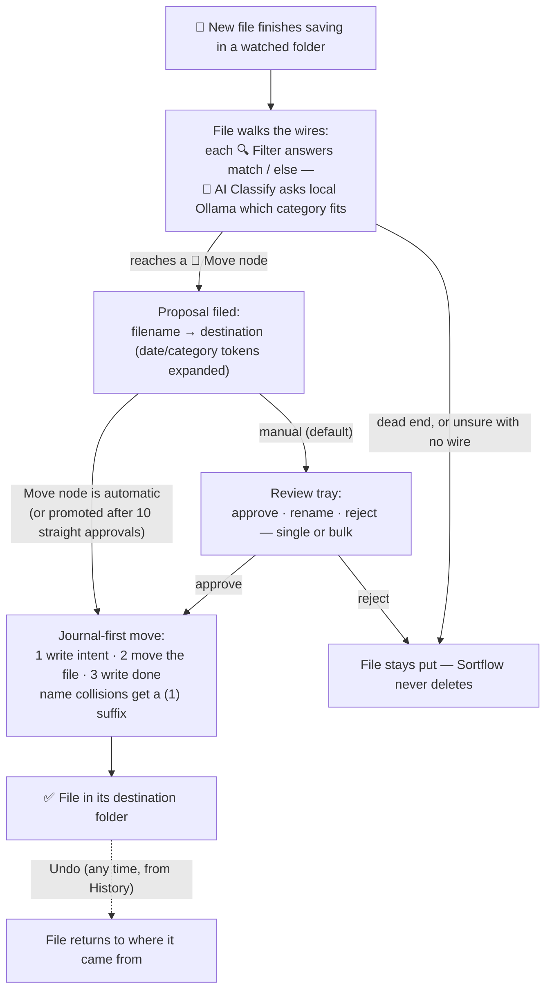

# Sortflow

**Visual, node-based smart file organizer.** Watch your Downloads and Desktop,
wire up filters and a local-AI classifier on a canvas, review proposed moves in
one click, undo anything. Free, offline, MIT-licensed.

<!-- demo gif goes here: record with the pipeline sorting a screenshot -->

## Why

- **The graph IS the rules.** No config files — drag Watch → Filter → AI
  Classify → Move nodes and connect them.
- **Not overbearing.** New files become *proposals* in a review tray; nothing
  moves until you approve. Rules you approve 10× in a row can go automatic.
- **Local AI, no API keys.** Ambiguous files are classified by
  [Ollama](https://ollama.com) on your machine. No Ollama? Everything still
  works — unclassified files just route to `unsure`.
- **Safe by construction.** Journal-first moves, no deletes, no overwrites,
  full undo. Event-driven watching: ~0% CPU at idle.

## How it works

You draw a flowchart once; Sortflow runs every new file through it forever.

```
                          ┌─ match ─▶ 📁 Move → ~/Pictures/Screenshots
📥 Watch ───▶ 🔍 Filter ──┤
~/Downloads    *.png      └─ else ──▶ 🤖 AI Classify ─┬─ School ──▶ 📁 Move → ~/Docs/School
                                                      ├─ Receipts ▶ 📁 Move → ~/Docs/Receipts
                                                      └─ unsure ──▶ (file stays put)
```

1. **📥 Watch** nodes are entry points. The moment a new file finishes saving
   into a watched folder, it enters the graph. (Event-driven — no scanning.)
2. The file travels the wires, answering questions. **🔍 Filter** nodes check
   extension / name pattern / size / age and route it out the `match` or
   `else` handle. **🤖 AI Classify** nodes ask a local model which of *your*
   categories fits and route it out that category's handle.
3. Reaching a **📁 Move** node doesn't move anything yet — it files a
   *proposal* in the **Review tray**: "`Screenshot.png` → `Pictures/Screenshots`".
   The menu-bar ⚑ shows how many proposals await you.
4. **You approve** (single or bulk). The move is journaled *before* it happens,
   so **Undo always works**. Approve a rule ~10 times in a row and its Move
   node offers to go automatic.
5. Files that dead-end (no wire for their answer) are left untouched. Sortflow
   never deletes or overwrites — name collisions get a ` (1)` suffix.

Move destinations accept tokens: `~/Docs/{category}/{YYYY}-{MM}` sorts by
AI category and month automatically. Use file-date tokens
(`{fileYYYY}`, `{fileMM}`, `{fileDD}`) to sort by the file's own date —
sweeping old files into `~/Pictures/Screenshots/{fileYYYY}-{fileMM}` groups
them by when they were created, not when you ran Sortflow.

### Your first pipeline (60 seconds)

1. **Add Watch** → folder `~/Downloads`
2. **Add Filter** → extensions `.png`
3. **Add Move** → destination `~/Pictures/Screenshots`
4. Drag wires: Watch → Filter, then Filter's `match` → Move
5. **Save & Apply**, drop a `.png` into Downloads, approve it in the tray —
   watch the dots run the wires.

## Install

Download the latest `.dmg` from Releases, or build from source:

```bash
git clone https://github.com/Da0t/sortflow && cd sortflow
pnpm install
pnpm --filter @sortflow/ui dev      # terminal 1
pnpm --filter @sortflow/app dev     # terminal 2
```

Optional AI classification: `brew install ollama && ollama pull llama3.2:3b`

## Architecture

Sortflow is a pnpm monorepo with three packages and a hard rule: **all domain
logic lives in `packages/engine`, which has zero Electron or React
dependencies** — it's pure TypeScript, so every behavior (watching, routing,
moving, undo) is unit-tested without booting an app.

| Package | Runs in | Responsibility |
| --- | --- | --- |
| `packages/engine` | anywhere (pure TS) | Watching, graph routing, AI classify, proposals, journal-first moves & undo, pipeline library, dry-run preview, NL→pipeline drafting |
| `packages/app` | Electron **main** process | Window + menu-bar item, typed IPC, hosts the engine, persists everything to disk |
| `packages/ui` | Electron **renderer** | React Flow canvas, palette, pipeline tabs, config panel, review tray — sandboxed, talks only through the preload bridge |

### System overview



### Life of a file (runtime path)



### End to end, in words

- **Edit time.** You draw on the canvas (or let *Auto Setup* scan a folder /
  *Describe It* draft a graph via Ollama). The graph lives in the renderer's
  zustand store until **Save & Apply**, which sends it over IPC: the main
  process validates the *merged* graph of every enabled pipeline, persists it
  to `pipelines.json`, then drains and hot-swaps the running engine. *Preview*
  runs the same graph as a dry run first — counts per destination, nothing
  moves. Pipeline tabs stash your canvas as a draft on every switch, so
  nothing is ever lost.
- **Run time.** The engine holds one merged graph. chokidar fires when a file
  finishes writing; `routeFile` walks it through filters (pure predicates) and
  classify nodes (queued, serialized calls to Ollama). Reaching a Move node
  files a *proposal* — the move itself only happens on approval or in
  automatic mode, and always journal-first so undo is guaranteed.
- **AI boundary.** Ollama is called in exactly two places — classifying a
  file that reached an AI node, and drafting a pipeline from a description —
  both local HTTP to `127.0.0.1:11434`, both optional, and both fail soft
  (classify falls back to `unsure`; drafting shows the error and retries with
  the rejection reason fed back to the model).
- **Safety invariants.** Moves are serialized (no two moves race), journaled
  before execution, collision-suffixed, and never destructive — no deletes,
  no overwrites, ever. The renderer is fully sandboxed; only the typed
  preload bridge can reach the filesystem.

See `docs/superpowers/specs/` for the original design doc, including the v2
roadmap (embedding-based category suggestions from the unsure pile).

## Contributing

PRs welcome — see [CONTRIBUTING.md](CONTRIBUTING.md). `pnpm test` must pass.

## License

MIT © Dat Nguyen
