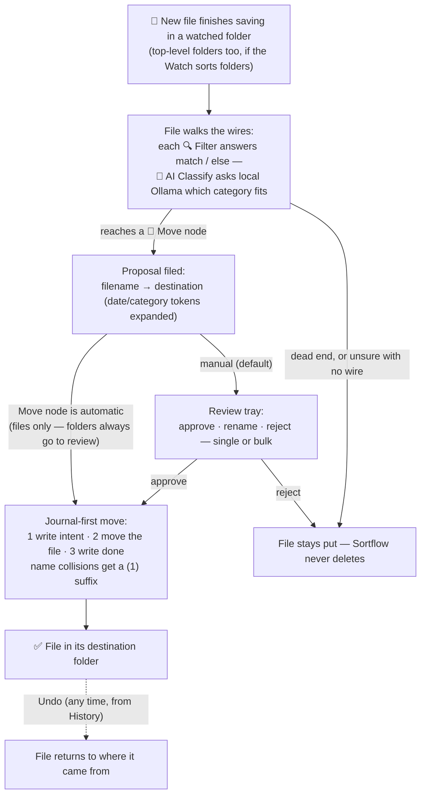

# Sortflow

[](https://github.com/Da0t/sortflow/actions/workflows/ci.yml)
[](LICENSE)


**Visual, node-based smart file organizer for macOS.** Watch your Downloads
and Desktop, wire up filters and a local-AI classifier on a canvas, review
proposed moves in one click, undo anything. Free, offline, MIT-licensed.

<!-- demo gif goes here: record with the pipeline sorting a screenshot -->

## Why

- **The graph IS the rules.** No config files — drag Watch → Filter → AI
  Classify → Move nodes and connect them.
- **Not overbearing.** New files become *proposals* in a review tray; nothing
  moves until you approve. After ~10 straight approvals a rule's Move node
  grows a one-click "Make automatic" option.
- **Local AI, no API keys.** Ambiguous files are classified by
  [Ollama](https://ollama.com) on your machine. No Ollama? Everything still
  works — unclassified files just route to `unsure`.
- **Safe by construction.** Journal-first moves, no overwrites, full undo —
  pipelines never delete anything, and the Files page's only delete is an
  explicit, confirmed move to the macOS Trash. Event-driven watching:
  ~0% CPU at idle.

## Features

- **Pipeline library** — multiple named pipelines in tabs; switch freely
  (unsaved edits are stashed automatically), toggle each one on/off, and run
  any number of them simultaneously.
- **Auto Setup** — tick the folders to scan (Downloads and Desktop by
  default) and get one drafted pipeline covering what's actually in them
  (screenshots, documents, installers, …).
- **Describe It** — type *"GIFs from Downloads go to Desktop/GIFs"* and a
  local Ollama model drafts the pipeline, grounded in your real folder names.
  Drafts load on the canvas for review; nothing runs until you apply.
- **Preview (dry run)** — see *"37 of 214 files would move: 22 →
  Desktop/Screenshots…"* before applying anything.
- **Your Folders** — a folder tree in the sidebar; drag any folder onto the
  canvas to create a Move rule, or onto an existing Move node to retarget it.
- **Sort into** — one setting points Auto Setup and Describe It at your
  preferred base (Desktop, Documents, or any folder you pick).
- **Review tray** — approve/reject singly or in bulk, rename a file before it
  moves, and restore rejected proposals if you fat-finger "Reject all".
- **AI classify with guidance** — give the classifier your own instructions
  ("receipts are purchase screenshots") that ride along with every file.
- **Tokens** — destinations and rename patterns understand `{category}`,
  `{YYYY}-{MM}`, and file-date tokens like `{fileYYYY}` for date-aware sorting.
- **Focus mode** — hide every panel and see just the graph.
- **Files page** — a cascade-column file manager on the same node canvas:
  click a folder and its contents open in the next column, as many branches
  as you like, every opened box highlighted as your trail back. Drag
  anything onto a folder to move it (journaled + undoable), create folders
  inline, or send one to the macOS Trash. Filter pills hide whole file
  kinds, and any folder can be muted from the view.
- **Sort folders too** — a Watch node option routes top-level folders
  through the graph as single units; AI Classify judges a folder by its
  name plus a listing of what's inside. Folder moves always wait for your
  approval, even on automatic rules.
- **Undo all** — one button in History walks the journal newest-first and
  puts every moved file back where it came from.
- **Permissions health check** — a banner warns when macOS is blocking
  Sortflow from Desktop, Documents, or Downloads, with a one-click recheck.
- **Unsaved-changes pulse** — the moment the canvas differs from the running
  pipeline, a hint appears and Save & Apply pulses until you apply.
- **Menu-bar app** — pending-review badge, Launch at Login, ~0% CPU idle.

## How it works

You draw a flowchart once; Sortflow runs every new file through it forever.

```
                          ┌─ match ─▶ 📁 Move → ~/Pictures/Screenshots
📥 Watch ───▶ 🔍 Filter ──┤
~/Downloads    *.png      └─ else ──▶ 🤖 AI Classify ─┬─ School ──▶ 📁 Move → ~/Docs/School
                                                      ├─ Receipts ▶ 📁 Move → ~/Docs/Receipts
                                                      └─ unsure ──▶ (file stays put)
```

1. **📥 Watch** nodes are entry points. The moment a new file finishes saving
   into a watched folder, it enters the graph (event-driven — no polling).
   Optionally they emit top-level folders as sortable units too.
2. The file travels the wires, answering questions. **🔍 Filter** nodes check
   extension / name pattern / age and route it out the `match` or
   `else` handle. **🤖 AI Classify** nodes ask a local model which of *your*
   categories fits and route it out that category's handle.
3. Reaching a **📁 Move** node doesn't move anything yet — it files a
   *proposal* in the **Review tray**: "`Screenshot.png` → `Pictures/Screenshots`".
   The menu-bar ⚑ shows how many proposals await you.
4. **You approve** (single or bulk — and rejected proposals can be restored).
   The move is journaled *before* it happens, so **Undo always works**.
   Approve a rule ~10 times in a row and a "Make automatic" button appears
   in its Move node's settings. Folder moves are the one exception:
   they always wait for review, even on automatic rules.
5. Files that dead-end (no wire for their answer) are left untouched. Sortflow
   never deletes or overwrites — name collisions get a ` (1)` suffix.

Move destinations accept tokens: `~/Docs/{category}/{YYYY}-{MM}` sorts by
AI category and month automatically. Use file-date tokens
(`{fileYYYY}`, `{fileMM}`, `{fileDD}`) to sort by the file's own date —
sweeping old files into `~/Pictures/Screenshots/{fileYYYY}-{fileMM}` groups
them by when they were created, not when you ran Sortflow.

### Your first pipeline (60 seconds)

1. **Add Watch** → folder `~/Downloads`
2. **Add Filter** → extensions `.png`
3. **Add Move** → destination `~/Pictures/Screenshots`
4. Drag wires: Watch → Filter, then Filter's `match` → Move
5. **Save & Apply**, drop a `.png` into Downloads, approve it in the tray —
   watch the dots run the wires.

## Install

macOS only for now. No packaged releases have shipped yet — build from
source (takes about a minute):

```bash
git clone https://github.com/Da0t/sortflow && cd sortflow
pnpm install
pnpm --filter @sortflow/app dist    # produces release/Sortflow-<version>-arm64.dmg
```

Or run the dev build:

```bash
pnpm --filter @sortflow/ui dev      # terminal 1
pnpm --filter @sortflow/app dev     # terminal 2
```

Optional local AI (classification + Describe It):

```bash
brew install ollama && brew services start ollama
ollama pull llama3.2:3b
```

## Documentation

| Doc | What's inside |
| --- | --- |
| [`packages/engine/README.md`](packages/engine/README.md) | The pure-TS core: routing, journal-first moves, AI classify, library, preview, drafting — with a module map and design decisions |
| [`packages/app/README.md`](packages/app/README.md) | The Electron main process: lifecycle, the full IPC surface, packaging |
| [`packages/ui/README.md`](packages/ui/README.md) | The React renderer: canvas, panels, Files page, store, testing notes |
| [`CHANGELOG.md`](CHANGELOG.md) | Everything shipped, release by release |
| [`CONTRIBUTING.md`](CONTRIBUTING.md) | Gates, house style, and the safety invariants PRs must keep |
| [`docs/`](docs/README.md) | Original design specs and implementation plans |

## Architecture

Sortflow is a pnpm monorepo with three packages and a hard rule: **all domain
logic lives in `packages/engine`, which has zero Electron or React
dependencies** — it's pure TypeScript, so every behavior (watching, routing,
moving, undo) is unit-tested without booting an app.

| Package | Runs in | Responsibility |
| --- | --- | --- |
| `packages/engine` | anywhere (pure TS) | Watching, graph routing, AI classify, proposals, journal-first moves & undo, pipeline library, dry-run preview, NL→pipeline drafting |
| `packages/app` | Electron **main** process | Window + menu-bar item, typed IPC, hosts the engine, persists everything to disk |
| `packages/ui` | Electron **renderer** | React Flow canvas, palette, pipeline tabs, config panel, review tray + history, Files page (cascade file manager) — sandboxed, talks only through the preload bridge |

### System overview

```mermaid
flowchart LR
    subgraph ui["Renderer — packages/ui (React + React Flow)"]
        direction TB
        Palette["Palette<br/>Auto Setup · Describe It (AI draft)<br/>node buttons · Your Folders tree"]
        Tabs["Pipeline tabs<br/>switch · rename · enable · delete"]
        Canvas["Canvas — the graph editor<br/>Watch · Filter · AI Classify · Move"]
        Config["Config panel<br/>node settings · Preview · Save & Apply"]
        ReviewUI["Review tray + History<br/>approve/reject (bulk) · restore rejected<br/>rename · undo · undo all"]
        FilesPage["Files page<br/>cascade file manager: move · create · trash"]
        Perms["Permissions banner<br/>macOS folder-access health check"]
        Store["zustand store<br/>(graph state)"]
        Palette --> Store
        Tabs --> Store
        Canvas <--> Store
        Config <--> Store
    end

    Bridge["Preload bridge — window.sortflow<br/>typed IPC, contextIsolation on,<br/>renderer has no Node/fs access"]

    subgraph app["Main process — packages/app (Electron)"]
        direction TB
        IPC["IPC handlers<br/>pipeline: set / preview / generate<br/>pipelines: switch / create / enable …<br/>proposals · journal (undo all) · streak<br/>fs: list / create / trash / checkAccess · files: move"]
        Library["PipelineLibrary<br/>named pipelines, one active (editor),<br/>any number enabled (running)"]
        Host["Engine host<br/>merges all enabled pipelines into one graph,<br/>hot-swaps the Engine on every apply"]
        MenuBar["Menu-bar ⚑<br/>pending-review badge · Launch at Login"]
        IPC --> Library
        IPC --> Host
    end

    subgraph engine["packages/engine — pure TypeScript, fully unit-tested"]
        direction TB
        Watcher["FolderWatcher<br/>chokidar, event-driven (~0% idle CPU)"]
        Route["routeFile<br/>walks one file through the graph"]
        Classifier["OllamaClassifier<br/>your categories + free-text guidance"]
        PropStore["ProposalStore<br/>review-first trust model"]
        Exec["executeMove / undoMove<br/>journal-first, collision-safe, serialized"]
        Journal["Journal<br/>append-only move log"]
        Extras["autosetup (folder scan → draft)<br/>previewPipeline (dry run)<br/>OllamaGenerator (Describe It)"]
        Watcher --> Route
        Route --> Classifier
        Route --> PropStore
        PropStore --> Exec
        Exec --> Journal
    end

    subgraph disk["On disk (Electron userData)"]
        P[("pipelines.json")]
        PR[("proposals.json")]
        J[("journal.jsonl")]
    end

    Ollama["Ollama — local llama3.2:3b<br/>optional: without it, files route to unsure"]
    Files[("Your folders<br/>~/Downloads · ~/Desktop · …")]

    ui <--> Bridge
    Bridge <--> IPC
    Host --> engine
    Library --> P
    PropStore --> PR
    Journal --> J
    Watcher --- Files
    Exec --> Files
    Classifier --> Ollama
    Extras --> Ollama
```



### Life of a file (runtime path)



### End to end, in words

- **Edit time.** You draw on the canvas (or let *Auto Setup* scan your checked folders /
  *Describe It* draft a graph via Ollama). The graph lives in the renderer's
  zustand store until **Save & Apply**, which sends it over IPC: the main
  process validates the *merged* graph of every enabled pipeline, persists it
  to `pipelines.json`, then drains and hot-swaps the running engine. *Preview*
  runs the same graph as a dry run first — counts per destination, nothing
  moves. Pipeline tabs stash your canvas as a draft on every switch, so
  nothing is ever lost.
- **Run time.** The engine holds one merged graph. chokidar fires when a file
  finishes writing; `routeFile` walks it through filters (pure predicates) and
  classify nodes (queued, serialized calls to Ollama). Reaching a Move node
  files a *proposal* — the move itself only happens on approval or in
  automatic mode, and always journal-first so undo is guaranteed.
- **AI boundary.** Ollama is called in exactly two places — classifying a
  file that reached an AI node, and drafting a pipeline from a description —
  both local HTTP to `127.0.0.1:11434`, both optional, and both fail soft
  (classify falls back to `unsure`; drafting shows the error and retries with
  the rejection reason fed back to the model).
- **Safety invariants.** Moves are serialized (no two moves race), journaled
  before execution, collision-suffixed, and never silently destructive — no
  overwrites ever, and the only deletion anywhere is the Files page's
  explicit, confirmed move to the macOS Trash. Manual Files-page moves run
  through the same journal as pipeline moves. The renderer is fully sandboxed; only the typed
  preload bridge can reach the filesystem.

See `docs/superpowers/specs/` for the original design doc, including the v2
roadmap (embedding-based category suggestions from the unsure pile).

## Project structure

```
packages/
  engine/   pure-TS domain core — watching, routing, moves, undo, AI
  app/      Electron main process — window, tray, IPC, engine host
  ui/       React renderer — canvas, palette, tabs, review tray, Files page
docs/       design specs and implementation plans
```

Each package has its own README with a module map and design notes:
[`packages/engine`](packages/engine/README.md) ·
[`packages/app`](packages/app/README.md) ·
[`packages/ui`](packages/ui/README.md)

## Development

Prerequisites: Node 22+ and pnpm 10.4 (`corepack enable` respects the
`packageManager` field).

```bash
pnpm install
pnpm -r test                        # engine + ui vitest suites
pnpm check                          # Biome lint + format
pnpm --filter @sortflow/ui dev      # browser demo (mocked bridge, no Electron)
pnpm --filter @sortflow/app dev     # full app against the Vite dev server
pnpm --filter @sortflow/app dist    # package a .dmg into packages/app/release/
```

CI runs `pnpm check` and `pnpm -r test` on macOS for every push and PR.

## FAQ

**Do I need Ollama?** No — filters, moves, review, and undo all work without
it. Ollama powers exactly two features: the AI Classify node and Describe It.
Install with `brew install ollama && brew services start ollama && ollama
pull llama3.2:3b`. If it's unreachable, classify routes files to `unsure`
and Describe It shows a clear error.

**Is it heavy?** No. Watching is event-driven (~0% CPU idle) and the AI model
only loads during classification bursts, then unloads itself. On 8 GB
machines you can switch a Classify node's model to `llama3.2:1b`.

**macOS says the app is from an unidentified developer.** Local builds are
unsigned. Right-click → Open the first time, or build it yourself from
source.

**Will it ever delete or overwrite my files?** Pipelines never delete or
overwrite anything: moves are journaled first, name collisions get a ` (1)`
suffix, and rejection/undo never touch file contents. The only deletion in
the app is the Files page's explicit Trash button, which moves items to the
macOS Trash — restorable there, never permanent.

## Contributing

PRs welcome — see [CONTRIBUTING.md](CONTRIBUTING.md). `pnpm check` and
`pnpm -r test` must pass (that's exactly what CI gates on).

## License

MIT © Dat Nguyen
